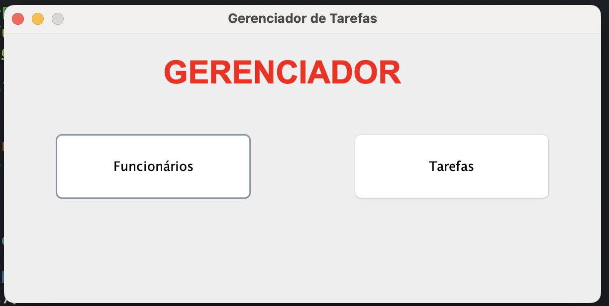

# 05-GestorTarefas
Atividade somativa para aplicação do conteúdo estudado no primeiro Semestre em linguagem de programação utilizando JAVA e JFRAME.

## Objetivo

Criar uma aplicação desktop que gerencia tarefas e funcionarios, permitindo o cadastro de funcionarios e tarefas alem de atribuir tarefas para funcionarios.

## Layouts

### Layout Gerenciador

### Layout Lista de Funcionario

### Layout Cadastro de Funcionario

### Layout Lista de Tarefas

### Layout Cadastro de Tarefas

## Tecnologias utilizadas:

- JAVA
- JFrame

## Autor

[Kauan Lopes](https://www.linkedin.com/in/kauan-lopes-pereira-91b5a022a/)